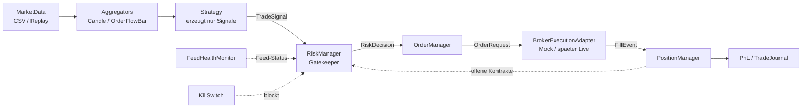
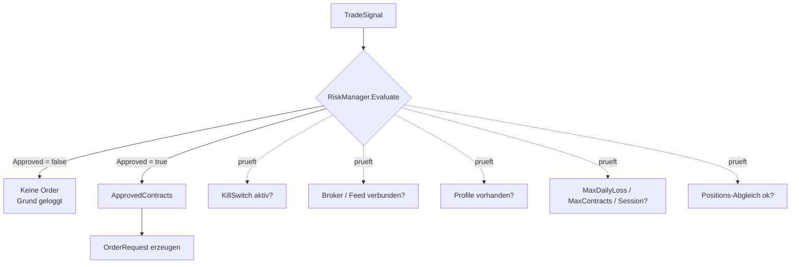
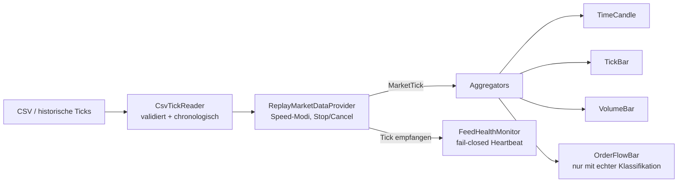
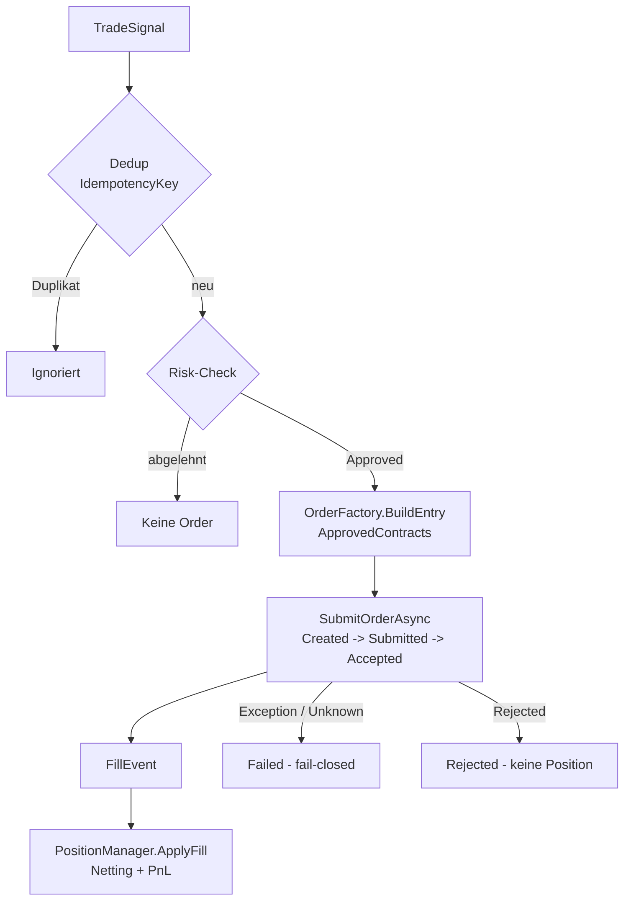

# Architektur – FuturesOrderflowBot

Read-only Architekturübersicht (Stand Phase 8A). Die Diagramme sind in Mermaid;
GitHub rendert sie automatisch.

**Grundprinzip:** Einbahnstraße für Signale mit mehreren Sicherheits-Gates, bevor
irgendetwas ausgeführt wird. Backtest, Paper und Live unterscheiden sich **nur** in
Feed (`IMarketDataProvider`) und Adapter (`IBrokerExecutionAdapter`) – die Signal→Risk→Order-Kette
ist in allen Modi identisch.

## Diagramm 1: Gesamtarchitektur

## Diagramm 2: Safety Flow

## Diagramm 3: MarketData Flow

## Diagramm 4: Order Flow

## Wichtige Designregeln

- **Strategy** hat keinen Zugriff auf Broker/Order/Risk – nur Signal-Output.
- **RiskManager** entscheidet ausschließlich (kein Senden), hat keine Execution-Referenz.
- **OrderManager** ist der einzige, der Orders baut/sendet – nur bei `Approved`.
- **PositionManager** ist Single Source of Truth, ohne Execution-Referenz.
- **FillEvents** sind die einzige Wahrheit für gefüllte Menge/Position.
- **Kein Fake-Orderflow:** ohne echte Bid/Ask/TradeDirection kein Delta.
