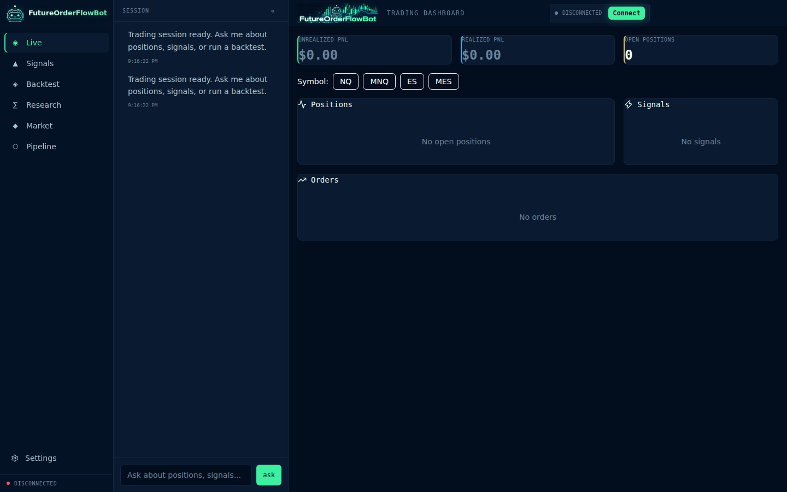
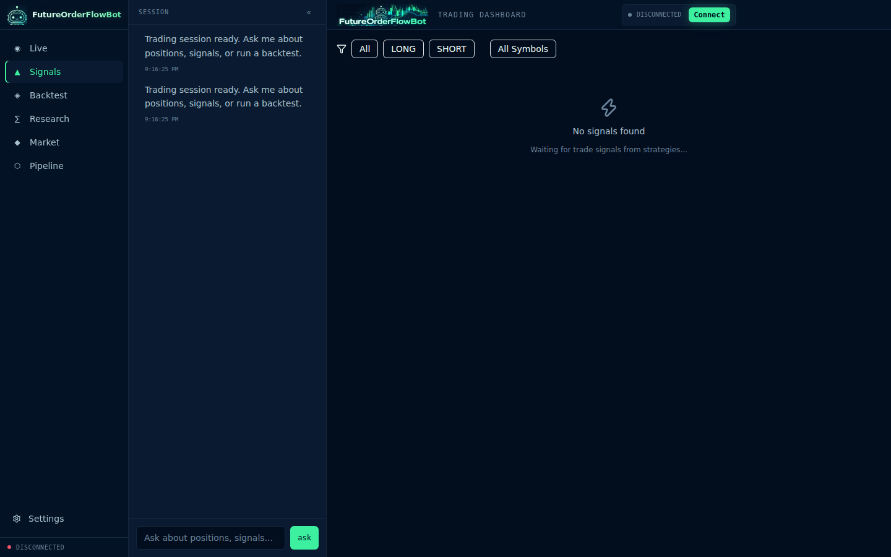
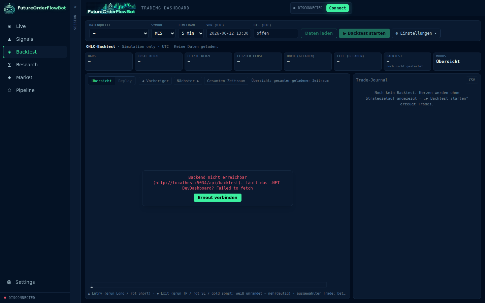
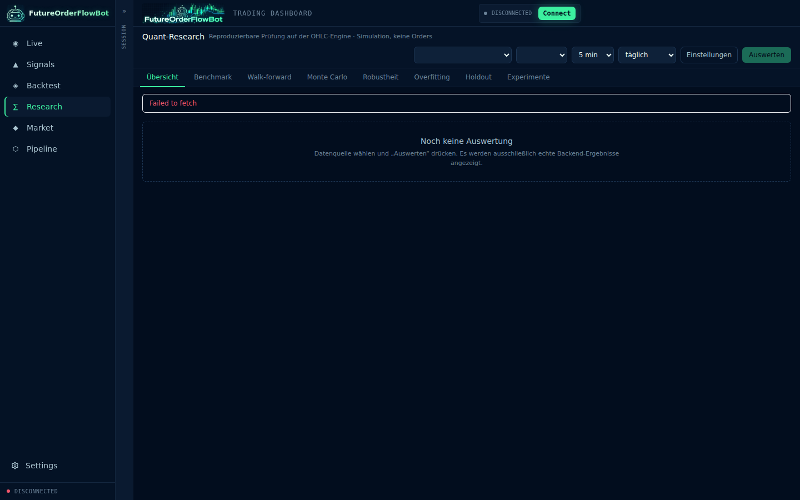
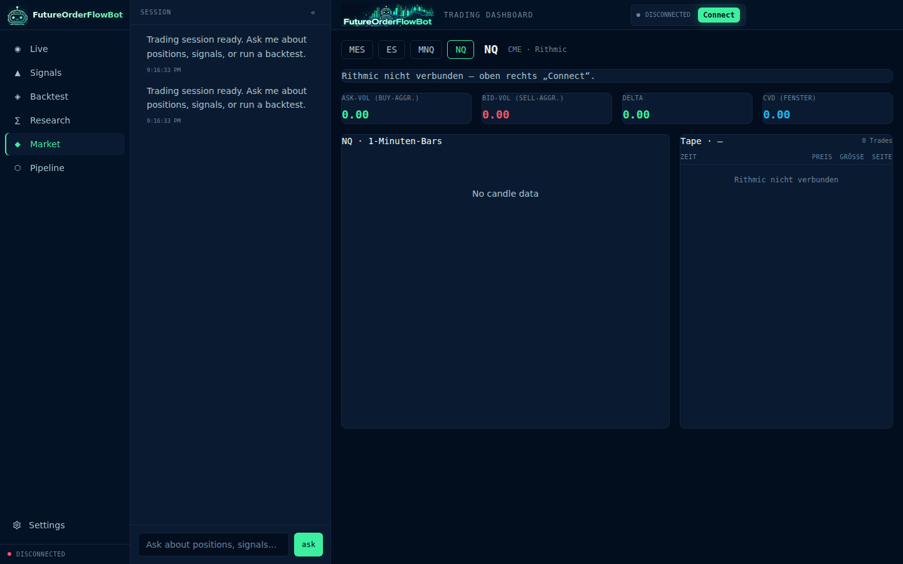
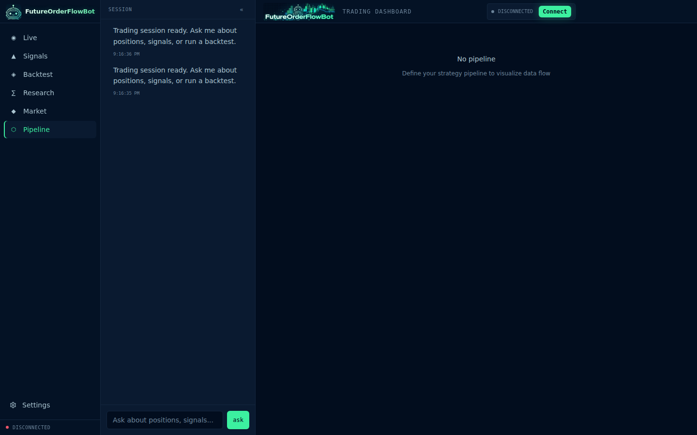
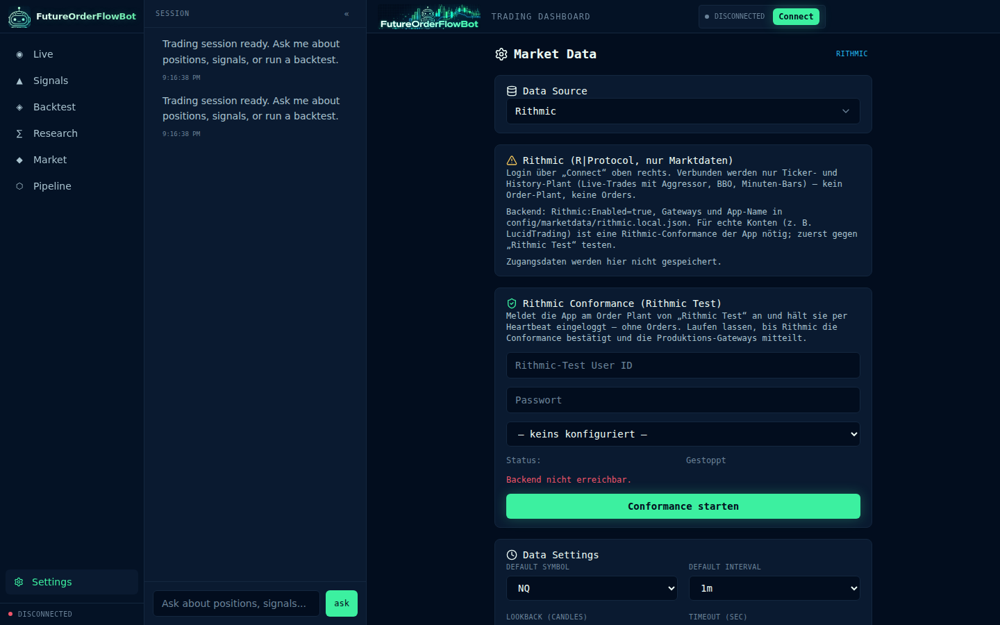

# Dashboard Screenshots

Screenshots des React-Dashboards (`dashboard/`, `npm run dev` → http://127.0.0.1:5899), ohne Live-Verbindung.

| Seite | Screenshot |
|---|---|
| Trading Desk (`/`) |  |
| Signals (`/signals`) |  |
| Backtest (`/backtest`) |  |
| Research (`/research`) |  |
| Market (`/market`) |  |
| Pipeline (`/pipeline`) |  |
| Settings (`/settings`) |  |
